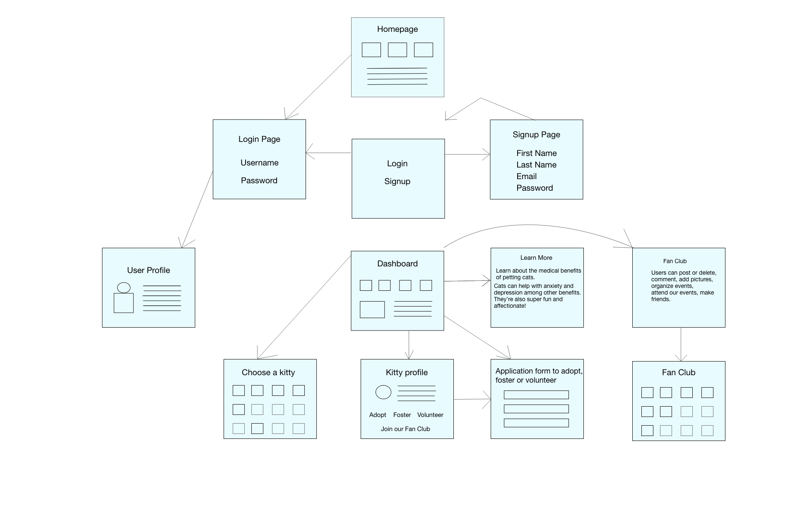
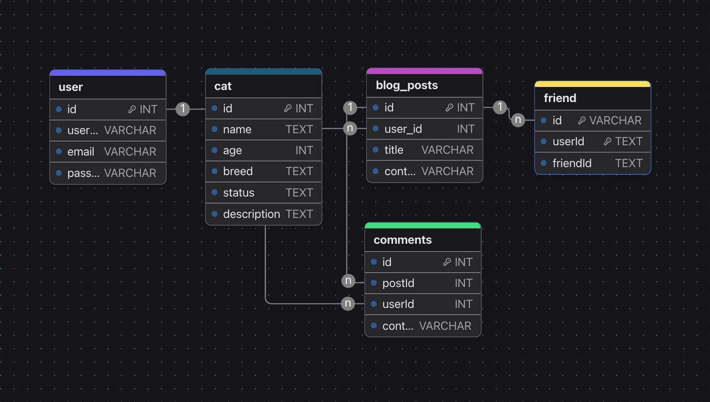

# Meow Matchmaker Full Stack App

## Project Description

The Meow Matchmaker App is a web application designed to connect users who are interested in adopting, fostering, or volunteering to help cats. Additionally, users can join a fan club to post and delete content, comment on posts, and make friends with other cat lovers.

## Table of Contents

- [Features](#features)
- [Installation](#installation)
- [Usage](#usage)
- [API Endpoints](#api-endpoints)
- [Models](#models)
- [User Stories](#user-stories)
- [Technologies Used](#technologies-used)
- [Contributing](#contributing)
- [License](#license)

## Features

- User authentication with secure password hashing
- Volunteer, foster, and adopt cats
- Join the fan club to post, delete, and comment
- Make friends with other cat lovers
- Responsive design for various screen sizes
- Error handling for broken links and server issues

## Installation

1. **Clone the repository:**

   ```sh
   git clone https://github.com/AlejandraValdivia/meow-matchmaker-app
   cd cat-adoption-app
   ```

## User Stories

- The users can sign up and log in, so they can access the app's features.
- As an admin, the user can manage cat listings, so they can add, update, or remove cats from the database.
- View available cats, so they can decide which one to adopt or foster or volunteer at our facilities.
- Join the fan club, so they can post and share content about cats.
- Comment on posts, so they can interact with other users.
- Delete posts, manage content.
- Make friends with other users, so they can connect with fellow cat lovers. 🥰😻

## Technologies Used

Backend: Node.js, Express
Frontend: EJS, CSS
Database: MongoDB, Mongoose
Authentication: Passport.js, bcrypt
APIs: Yelp API (optional, for nearby pet services)
Contributing
Fork the repository.
Create your feature branch: git checkout -b feature/YourFeature
Commit your changes: git commit -m 'Add some feature'
Push to the branch: git push origin feature/YourFeature
Open a pull request.

## Installation Instructions
1.- Fork the repository
2.- Clone the repository to your local machine
3.- Install the following packages:
   - npm install
   - npm install express
   - npm install express-session
   - npm install method-override
   - npm install axios
   - npm install mongoose
   - npm install mongodb
   - npm install ejs
   - npm install dotenv
   


## Wireframe



## ERD

### User 👧🏽 👦🏻

- id
- username
- email
- password

### Cat

- id
- name
- image
- description
- age (life span)
- origin (country of origin)
- afectionLevel


### Post

- id
- userId
- title
- content
- userId

### Comment

- id
- content
- userId
- postId

### Friend

- id
- userId
- friendId


